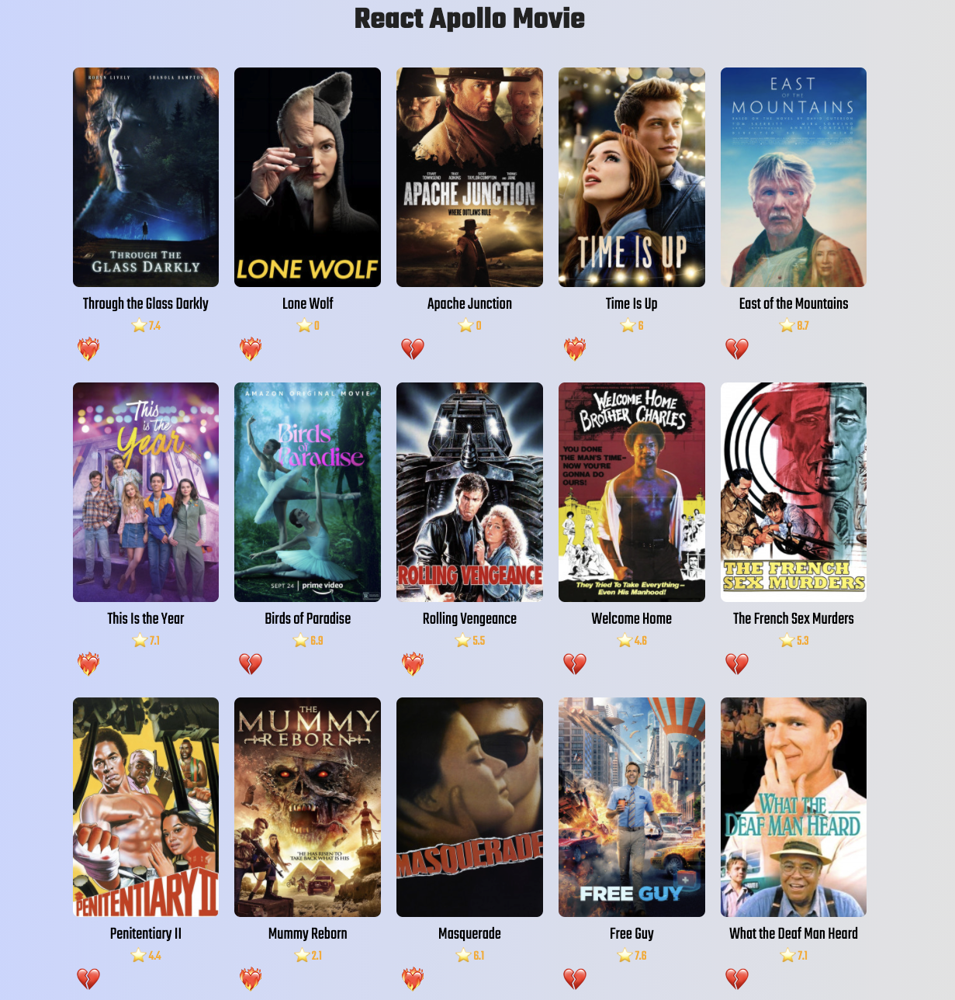

# Apollo-GraphQL-Course

## 🔗 Demo

## 🖥 Preview

## 🔥 Stack

### Front-end

### Back-end

 

## ✅ Packages

- [x] React
- [x] React Router
- [x] Apollo
- [x] GraphQL

## 📖 Theory

- [x] Query
- [x] Mutation
- [x] Replace Fetch
- [x] Replace Redux
